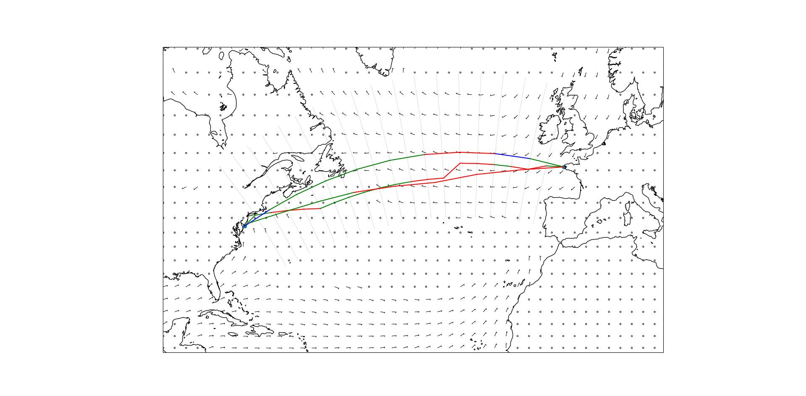

# Sailing Weather Routing

Fetch weather data from DWD (ICON weather model) and calculate the optimal route for a sailing boat using diferent algorithms.

## Requirements
* Netcdf
* Proj + pyproj (tested on 3.4.1)
* [CDO](https://code.mpimet.mpg.de/projects/cdo) (tested on 1.9.9)
* numpy (tested on 1.23.4)
* matplotlib (tested on 3.8.0)
* cartopy (tested on 0.22.0)
* shapely (tested on 2.0.2)

## How to use

We first need to install the dependencies. On our test machine running fedora, we needed compile and install CDO from source.

After installing all dependencies, we need to create a temporary directory to store the weather data. 
```bash
mkdir tmp
```

Afterwards, we can fetch the weather grib files:
```bash
python -m grib_loader
```

And finally, we can run the router
```bash
python -m routers.router
```

The resulting plot will by default show the great circle route (i.e. shortest path), the fastest route using the dynamic programming algorithm and the shortest path using the isochrone algorithm. Each leg is currently colored to show the speed at which it can be sailed (black < 2 m/s, blue 2-3 m/s, green 3-4 m/s, red > 4 m/s).



Currently, it's more of a playground and there are a lot of hard-coded values and no CLI args. Processing the grib files is currently also partly done through external tools (bzip, cdo). And it's a bit of a mess. Lots of to dos. :) 

- [ ] Add CLI args
- [ ] Avoid land
- [ ] Is it possible to call cdo and bzip from python?
- [ ] Slider to show the route over time incl. weather data
- [ ] add requirements.txt and setup.py
- [ ] Optimize algorithms
- [ ] Only load area of weather data that is needed

## Similar Repos
* https://github.com/TAJD/SailRoute.jl
* https://github.com/mak08/VirtualHelm
* https://github.com/dakk/gweatherrouting
* https://github.com/dakk/libweatherrouting
* https://github.com/jrversteegh/softsailor
* https://github.com/jorisv/tiny_sea
* https://github.com/seandepagnier/weather_routing_pi
* https://github.com/nohal/qtVlm

## Free Tools
* https://opencpn.org/
* qtVLM https://www.meltemus.com/index.php/en/
* http://zezo.org/
* VRTool http://www.tecepe.com.br/nav/vrtool/default.htm
* https://fastseas.com/
* https://www.sailgrib.com/

## Resources
* http://www.tecepe.com.br/nav/vrtool/routing.htm
* http://www.sailonline.org/
* https://www.virtualregatta.com/en/
* https://en.wikipedia.org/wiki/Sailing_weather_prediction
* https://en.wikipedia.org/wiki/Shortest_path_problem
* https://en.wikipedia.org/wiki/Pathfinding
* http://www.oceansail.co.uk/Articles/index.php
* https://routing.luckgrib.com/intro/isochrones/deep.html
* http://www.altendorff.co.uk/archives/1116
